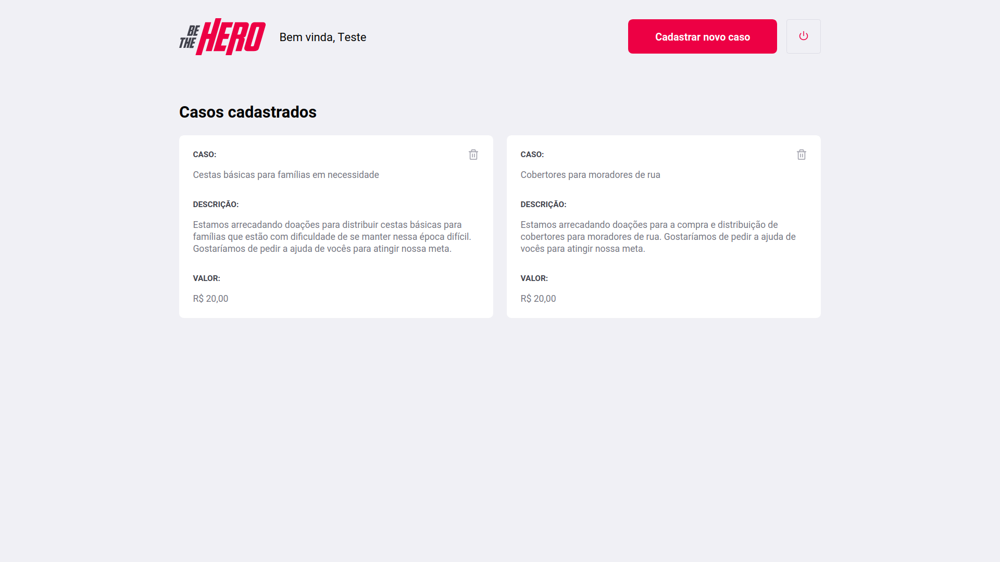

# semanaomnistack11
Repositório para o projeto desenvolvido durante a Semana Omnistack 11 da Rocketseat.

Projeto para conectar ONG's a pessoas capazes de ajudar, implementado
com a stack **Node.js**, **React** e **React Native** sob a tutoria de Diego Fernandes da [Rocketseat](https://rocketseat.com.br/).

# Screenshots

### Web App - Tela de Login das ONG's

### Web App - Lista de casos cadastrados pela ONG

### Web App - Cadastrar novos casos

### Mobile App - Lista de todos os casos cadastrados e mais detalhes sobre cada um com opção para envio de mensagem

Casos cadastrados          |  Mais detalhes
:-------------------------:|:-------------------------:
 |  